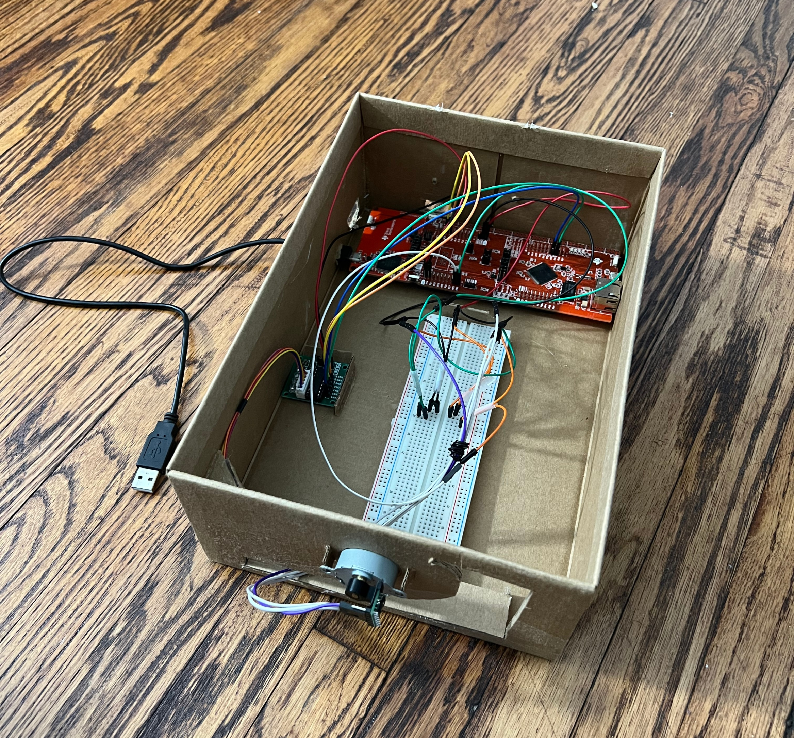

# 3D Room Scanner

A 3D room scanner built using an MSP432 microcontroller and a VL53L1X Time-of-Flight (ToF) sensor. The device measures multiple 360° planes of the room and generates a 3D rendering of the surrounding environment on the connected computer.

    

## Usage

 1. Assemble and connect the scanner to the PC.
 2. Upload the firmware to the MCU.
 3. Position the scanner in the room of choice.
 4. Click the onboard pushbutton PJ1 to enable measurements, run the visualization code, and click PJ0 to begin measuring.
 5. After each 360° y-z scan, manually move the device the desired x-distance.
 6. After collection is complete, a 3D rendering will be generated from the collected data.

## Features

 - 360° y-z scanning and data collection
 - Configurable number of scans in the x-direction
 - Configurable distance between x-scans
 - ToF distance measaurement
 - Stepper motor positioning
 - UART communication with a PC
 - I2C communication with the ToF sensor
 - 3D point cloud generation

## Hardware

 - MSP432 microcontroller
 - VL53L1X ToF sensor
 - 28BYJ-48 Stepper motor and motor driver
 - Sensor mount
 - Power supply

## Software

### Embedded Firmware

 - C Programming Language
 - Developed in Keil uVision5
 - Controls motor rotation
 - Collects and stores ToF distance measurements
 - Transmits data to the PC via UART

### Visualization Software

 - Python
 - Receives measurement data
 - Converts measurements into Cartesian coordinates
 - Generates 3D rendering 

## Configuration

To modify the number of x-measurements that are taken, modify the variable xMEASUREMENTS.
This parameter can be modified in include/ToFSensor.h and visualization/3d_room_scanner.py. The parameter must be changed in both files for proper functionality.

To modify the distance between x-measurements (in mm), modify the variable xDISTANCE.
This parameter can be modified in visualization/3d_room_scanner.py.

NOTE: Ensure that port is correct in the visualization code.

## Wiring

| Component | MSP432 Pins |
|------------|------------|
| ToF VIN | 3.3 V|
| ToF SCL | PB2 | 
| ToF SDA | PB3 |
| Motor Driver VIN | 5 V |
| Motor Driver IN1–IN4 | PH0–PH3 | 

## Mechanical Assembly

The prototype was mounted on a cardboard enclosure to organize and support the devices used. To prevent excessive tension from the wires connected to the ToF sensor, the motor returns to its starting position before beginning its next scan.

A 3D-printed mounting bracket was used to attach the ToF sensor to the motor shaft. This allows the 360° rotation.

    

## Results

### Scanned Area

    

### 3D Rendering

    

    

    

## Future Improvements

 - Higher scan resolution
 - Automated x-axis movement
 - Wireless data transfer
 - Improved enclosure
 - Real-time visualization

## Author

Luca Burattini
